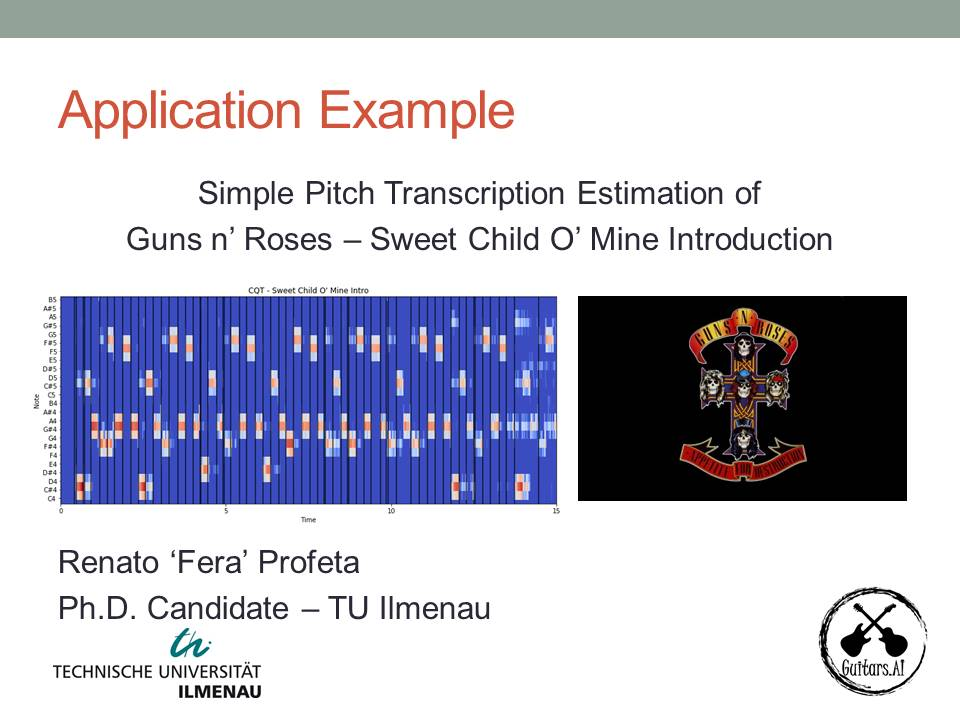

# Basics of Pitch Estimation
Basics of Pitch Estimation Using CQT

Renato Profeta 
PhD Candidate at [TU Ilmenau](https://www.tu-ilmenau.de/en/applied-media-systems-group/) 
Artificial Intelligence Applied to Guitars 
https://www.facebook.com/GuitarsAI/ 
http://www.rptecnologias.com  
https://www.instagram.com/guitars.ai/

